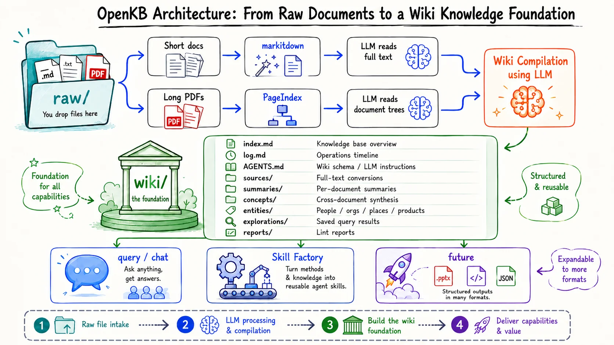

<div align="center">

<a href="https://openkb.ai">
  
</a>

<br />
<br />

<p align="center">
<a href="https://trendshift.io/repositories/26145" target="_blank"></a>
</p>

# OpenKB: Open LLM Knowledge Base

<p align="center"><i>Scale to long documents  •  Reasoning-based retrieval  •  Native multi-modality  •  No Vector DB</i></p>

</div>

<details open>
<summary><h2>📢 Recent Updates</h2></summary>

- *Google Open Knowledge Format (OKF)*: Wiki pages follow the [Google OKF](https://cloud.google.com/blog/products/data-analytics/how-the-open-knowledge-format-can-improve-data-sharing) specification for knowledge sharing.
- *Entity Pages*: People, orgs, places, and products as dedicated wiki pages, auto-extracted and kept in sync.

</details>

---

# 📑 What is OpenKB

**OpenKB (Open Knowledge Base)** is an open-source system (in CLI) that compiles raw documents into a structured, interlinked wiki-style knowledge base using LLMs, powered by [**PageIndex**](https://github.com/VectifyAI/PageIndex)'s vectorless, reasoning-based retrieval for long documents.

The idea is based on a [concept](https://x.com/karpathy/status/2039805659525644595) described by Andrej Karpathy: LLMs generate summaries, concept pages, and cross-references, all maintained automatically. Knowledge compounds over time instead of being re-derived on every query.

### Why not traditional RAG?

Traditional RAG rediscovers knowledge from scratch on every query. Nothing accumulates. OpenKB compiles knowledge once into a persistent wiki, then keeps it current. Cross-references already exist, contradictions are flagged, and synthesis reflects everything consumed.

OpenKB has two layers: a **wiki foundation** that compiles and maintains your knowledge, and **generators** (query / chat / Skill Factory) that turn it into useful output. See [Usage](#️-usage) for the full command list.

### Features

- **Broad format support:** PDF, Word, Markdown, PowerPoint, HTML, Excel, CSV, text, URLs, and more.
- **Scales to long documents:** Long and complex documents are handled via [PageIndex](https://github.com/VectifyAI/PageIndex) tree indexing, enabling accurate, vectorless, context-aware retrieval.
- **Native multi-modality:** Retrieves and understands figures, tables, and images, not just text.
- **Compiled wiki:** The LLM compiles your documents into summaries, concept pages, entity pages, and cross-links, all kept in sync.
- **Query & chat:** One-off questions or multi-turn conversations over your wiki, with persisted sessions to resume.
- **Skill Factory:** Distills redistributable agent skills from your wiki.
- **OKF-ready:** Wiki pages follow the [Google OKF](https://cloud.google.com/blog/products/data-analytics/how-the-open-knowledge-format-can-improve-data-sharing) specification for knowledge sharing.
- **Obsidian-compatible:** The wiki is plain `.md` files with cross-links. Opens in Obsidian for graph view.
- **Knowledge Workbench (Web UI):** A bundled React SPA served at `/` turns the REST API into a full dark-themed three-pane workbench — browse stats, upload & compile documents, stream queries/chats with a live reasoning timeline, and run maintenance, all in the browser. No separate frontend server needed.

# 🚀 Getting Started

### Install

```bash
pip install openkb
```

<details>
<summary><b><i>Other install options:</i></b></summary>

- **Latest from GitHub:**
  
  ```bash
  pip install git+https://github.com/VectifyAI/OpenKB.git
  ```

- **Install from source** (editable, for development):
  
  ```bash
  git clone https://github.com/VectifyAI/OpenKB.git
  cd OpenKB
  pip install -e .
  ```

</details>

### Quick Start

```bash
# 1. Create a directory for your knowledge base
mkdir my-kb && cd my-kb

# 2. Initialize the knowledge base
openkb init

# 3. Add documents
openkb add paper.pdf
openkb add ~/papers/                            # Add a whole directory
openkb add https://arxiv.org/pdf/2509.11420     # Or fetch from a URL

# 4. Ask a question
openkb query "What are the main findings?"

# 5. Or chat interactively
openkb chat

# (Optional) Turn the wiki into other outputs
openkb skill new my-expert "Reason like an expert on <your-topic>"   # a portable agent skill
openkb visualize                                                     # an interactive knowledge graph
openkb deck new my-deck "An intro deck on <your-topic>"              # slides — a single-file HTML deck
```

### Set up your LLM

OpenKB supports [multiple LLM providers](https://docs.litellm.ai/docs/providers) (OpenAI, Claude, Gemini, etc.) via [LiteLLM](https://github.com/BerriAI/litellm) (pinned to a [safe version](https://docs.litellm.ai/blog/security-update-march-2026)).

Set your model during `openkb init` or in [`.openkb/config.yaml`](#configuration) using the `provider/model` LiteLLM format (e.g. `anthropic/claude-sonnet-4-6`). OpenAI models can omit the prefix (e.g. `gpt-5.4`).

Create a `.env` file with your LLM API key:

```bash
LLM_API_KEY=your_llm_api_key
```

### Knowledge Workbench (Web UI)

OpenKB ships a bundled React single-page app — the **Knowledge Workbench** — served directly by the REST server at `/`, so you get a full browser interface with no separate frontend process.

```bash
# 1. build front web
cd frontend/
npm install
npm run build

# back project root
cd ..

# 2. Set server variables (in .env or your shell)
OPENKB_API_TOKEN=test-token     # bearer token the browser sends
OPENKB_KB_ROOT=/path/to/kbs     # where REST /init creates KBs

OR Edit .env and config.yaml

# 3. Install with the API extra and start the server
pip install -e ".[api]"
python -m openkb.api --host 127.0.0.1 --port 8000                      # serves the API + Workbench at http://127.0.0.1:8000/
```

Open `http://127.0.0.1:8000/` in your browser. On first launch a **Connection Settings** dialog asks for the API base (leave blank for same-origin) and the bearer token. The Workbench then provides:

- **Overview** — index/concept/summary/report stat cards, clickable concept chips, recent documents, and last-compile/lint activity.
- **Documents** — drag-and-drop multi-file upload with per-file SSE progress, hash table, and delete with confirmation.
- **Query** — streamed answers with `tool_call` reasoning shown live in the right-pane timeline; GFM Markdown rendering (bold, tables, code, etc.).
- **Chat** — multi-turn streaming with a persisted session list: load history, resume a session, delete it.
- **Maintenance** — lint (with optional auto-fix), recompile (all or single doc, SSE log), and a file-watcher toggle.

A right-pane **Inspector** timeline shows the vectorless retrieval & reasoning steps for every streamed operation. Creating a new KB from the Workbench inherits the project-root `config.yaml` and LLM credentials (`.env`) so it runs queries out of the box. The UI is responsive — on narrow screens the three panes collapse to a single column with a hamburger nav.

# 🧩 How OpenKB Works

### Architecture

<div align="center">
  
</div>

### Short vs Long Document Handling

|               | Short documents            | Long documents (PDF ≥ 20 pages)    |
| ------------- | -------------------------- | ---------------------------------- |
| **Convert**   | markitdown → Markdown      | PageIndex → tree index + summaries |
| **Images**    | Extracted inline (pymupdf) | Extracted by PageIndex             |
| **LLM reads** | Full text                  | Document trees                     |
| **Result**    | summary + concepts         | summary + concepts                 |

Short documents are read in full by the LLM. Long PDFs are processed by [PageIndex](https://github.com/VectifyAI/PageIndex) into a hierarchical tree index. The LLM reads the tree instead of the full text, enabling accurate and scalable retrieval for long documents.

### Knowledge Compilation

When you add a document, the LLM:

1. Generates a **summary** page
2. Reads existing **concept** and **entity** pages
3. Creates or updates concepts with cross-document synthesis
4. Creates or updates **entity** pages (people, orgs, places, products)
5. Updates the **index** and **log**

A single source might touch 10--15 wiki pages. Knowledge accumulates: each document enriches the existing wiki rather than sitting in isolation.

# ⚙️ Usage

OpenKB commands fall into two layers: the **wiki foundation** (compile + manage your knowledge) and **generators** (turn that wiki into useful output). Each links to a concrete walkthrough — a real artifact OpenKB generated from one sample paper (browse them all in [`examples/`](examples/)).

## Layer 1: 🧱 Wiki Foundation — compile and maintain

| Command                                                      | Description                                                                             |
| ------------------------------------------------------------ | --------------------------------------------------------------------------------------- |
| `openkb init`                                                | Initialize a new knowledge base (interactive)                                           |
| <code>openkb&nbsp;add&nbsp;&lt;file_or_dir_or_URL&gt;</code> | Add files, directories, or URLs and compile to wiki (URL content type is auto-detected) |
| `openkb list`                                                | List indexed documents and concepts                                                     |
| `openkb status`                                              | Show knowledge base stats                                                               |
| `openkb watch`                                               | Watch `raw/` and auto-compile new files                                                 |
| `openkb lint`                                                | Run structural and knowledge health checks                                              |

<details>
<summary><i>More wiki commands:</i></summary>
<br>

| Command                                                            | Description                                                                                                                                                                                                                          |
| ------------------------------------------------------------------ | ------------------------------------------------------------------------------------------------------------------------------------------------------------------------------------------------------------------------------------ |
| <code>openkb&nbsp;remove&nbsp;&lt;doc&gt;</code>                   | Remove a document and clean up its wiki pages, images, registry, and PageIndex state (`--dry-run` to preview, `--keep-raw` / `--keep-empty` to retain artifacts)                                                                     |
| <code>openkb&nbsp;recompile&nbsp;[&lt;doc&gt;]&nbsp;[--all]</code> | Re-run the compile pipeline on already-indexed docs without re-indexing. Regenerates summaries and rewrites concept pages; manual edits are overwritten (`--dry-run` to preview, `--refresh-schema` to also update `wiki/AGENTS.md`) |
| <code>openkb&nbsp;feedback&nbsp;["msg"]</code>                     | File feedback by opening a prefilled GitHub issue (`--type bug/feature/question` to tag it)                                                                                                                                          |

</details>

→ **Example:** the everyday loop walked through end to end — [`examples/commands/`](examples/commands/).

## Layer 2: 💡 Generators — turn the wiki into output

A "generator" reads from the compiled wiki and produces something usable: an answer, a conversation, a skill folder. The wiki is the substrate; generators are the surfaces.

| Command                                                                               | Output                                                                                                         | Example                            |
| ------------------------------------------------------------------------------------- | -------------------------------------------------------------------------------------------------------------- | ---------------------------------- |
| <code>openkb&nbsp;query&nbsp;"question"</code>                                        | A grounded answer with citations (`--save` to persist to `wiki/explorations/`)                                 | [query & save](examples/commands/) |
| <code>openkb&nbsp;chat</code>                                                         | Interactive multi-turn session over the wiki (`--resume`, `--list`, `--delete` to manage sessions)             | [chat](examples/chat/)             |
| <code>openkb&nbsp;visualize</code>                                                    | A self-contained interactive knowledge graph at `output/visualize/graph.html` — 3D, mind-map, and radial views | [visualize](examples/visualize/)   |
| <code>openkb&nbsp;skill&nbsp;new&nbsp;&lt;skill-name&gt;&nbsp;"&lt;intent&gt;"</code> | Distill a redistributable agent skill from your wiki (see [Skill Factory](#skill-factory) below)               | [skills](examples/skills/)         |
| <code>openkb&nbsp;deck&nbsp;new&nbsp;&lt;name&gt;&nbsp;"&lt;intent&gt;"</code>        | Generate a single-file HTML slide deck (`--skill` picks a theme, `--critique` runs a quality pass)             | [slides](examples/slides/)         |

<details>
<summary><i>More skill commands:</i></summary>
<br>

| Command                                                                                                                        | Output                                                 |
| ------------------------------------------------------------------------------------------------------------------------------ | ------------------------------------------------------ |
| <code>openkb&nbsp;skill&nbsp;validate&nbsp;[name]</code>                                                                       | Validate compiled skills (auto-runs after `skill new`) |
| <code>openkb&nbsp;skill&nbsp;eval&nbsp;&lt;name&gt;</code>                                                                     | Check the skill triggers on the right prompts          |
| <code>openkb&nbsp;skill&nbsp;history&nbsp;&lt;name&gt;</code> / <code>openkb&nbsp;skill&nbsp;rollback&nbsp;&lt;name&gt;</code> | Version history + rollback for skills                  |

</details>

<a id="skill-factory"></a>

### 🛠 Skill Factory — *drop in a book; out comes a digital expert.*

The flagship generator: `openkb skill new` distills a portable [agent skill](https://docs.claude.com/en/docs/build-with-claude/skills) from your wiki that Claude Code, Codex, and Gemini can install and load natively. Drop in a book's worth of papers; out comes a specialist other agents can call on. → A real generated skill, plus install / share / `eval` / rollback, is walked through in **[`examples/skills/`](examples/skills/)**.

# 🔧 Configuration

### Settings

`openkb init` writes `.openkb/config.yaml`:

```yaml
model: gpt-5.4                   # LLM model (any LiteLLM-supported provider)
language: en                     # Wiki output language
pageindex_threshold: 20          # PDF pages threshold for PageIndex
```

The full settings reference — `entity_types`, OAuth providers (`chatgpt/*`, `github_copilot/*`), and LiteLLM tuning (timeouts for slow local runtimes like Ollama / LM Studio, `drop_params`, GitHub Copilot headers, install notes) — is in **[`examples/configuration/`](examples/configuration/)**.

### PageIndex Setup

Long-document retrieval is a [known challenge](https://x.com/karpathy/status/2039823314982744522) for LLMs. [PageIndex](https://github.com/VectifyAI/PageIndex) solves this with vectorless, reasoning-based retrieval, by building a hierarchical tree index that lets LLMs reason over the index for context-aware retrieval.

PageIndex runs locally by default using the [open-source version](https://github.com/VectifyAI/PageIndex), with no external dependencies required.

***Cloud Support*** *(Optional)*:

For large or complex PDFs, [PageIndex Cloud](https://docs.pageindex.ai/) can be used to access additional capabilities, including:

- OCR support for scanned PDFs (via hosted VLM models)
- Faster structure generation
- Scalable indexing for large documents

Set `PAGEINDEX_API_KEY` in your `.env` to enable cloud features:

```
PAGEINDEX_API_KEY=your_pageindex_api_key
```

→ **Example:** local vs. cloud indexing, and importing a cloud-indexed doc — [`examples/pageindex-cloud/`](examples/pageindex-cloud/).

### AGENTS.md

The `wiki/AGENTS.md` file defines wiki structure and conventions. It's the LLM's instruction manual for maintaining the wiki. Customize it to change how your wiki is organized.

The LLM reads `AGENTS.md` from disk at runtime, so your edits take effect immediately.

# 🔌 Integrations

### Using with Obsidian

The wiki is a directory of Markdown files with `[[wikilinks]]`. Obsidian renders it natively.

1. Open `wiki/` as an Obsidian vault
2. Browse summaries, concepts, and explorations
3. Use graph view to see knowledge connections
4. Use Obsidian Web Clipper to add web articles to `raw/`

### Using with Claude Code / Codex / Gemini CLI

OpenKB ships a `SKILL.md` so any agent can read your compiled wiki. No extra runtime, no MCP setup, just install the skill once.

<details>
<summary><i>Claude Code:</i></summary>
<br>

```
/plugin marketplace add VectifyAI/OpenKB
/plugin install openkb@vectify
```

</details>

<details>
<summary><i>OpenAI Codex CLI:</i></summary>
<br>

*(no marketplace command yet; manual symlink)*

```bash
git clone https://github.com/VectifyAI/OpenKB.git ~/openkb-src
mkdir -p ~/.agents/skills
ln -s ~/openkb-src/skills/openkb ~/.agents/skills/openkb
```

</details>

<details>
<summary><i>Gemini CLI:</i></summary>
<br>

```bash
gemini skills install https://github.com/VectifyAI/OpenKB.git --path skills/openkb --consent
```

</details>

The skill is read-only. It won't run `openkb add`, `remove`, or `lint --fix` without you asking. See [`skills/openkb/SKILL.md`](skills/openkb/SKILL.md) for the full instruction set.

# REST API

OpenKB also ships a FastAPI service for using a knowledge base from Postman,
frontends, or other HTTP clients.

Install the API dependencies if needed:

```bash
pip install -e ".[api]"
```

Start the API server:

```powershell
$env:OPENKB_API_TOKEN="test-token"
$env:OPENKB_KB_ROOT="D:\project\OpenKB\kbs"
.\.venv\Scripts\python.exe -m openkb.api --host 127.0.0.1 --port 8000
```

### Authentication and common behavior

`OPENKB_API_TOKEN` is required. Send it on every request:

```text
Authorization: Bearer test-token
```

`OPENKB_KB_ROOT` is optional. It controls where REST-created knowledge bases
are stored. If unset, OpenKB uses `~/.config/openkb/kbs`.

REST clients identify a knowledge base with `kb`, not a filesystem path. For
example, `postman-kb` resolves to `$OPENKB_KB_ROOT/postman-kb`.

Common status codes across all endpoints:

- `200` — success.
- `400` — invalid request body, unknown `kb`, or a KB that isn't an OpenKB dir
  (missing `.openkb/` or `wiki/`).
- `401` — missing or wrong bearer token.
- `404` — referenced document/watcher not found (remove/recompile/watch-stop).
- `409` — ambiguous identifier (remove/recompile) with `candidates` in `detail`.
- `500` — server error, or `OPENKB_API_TOKEN` not configured on the server.

All JSON endpoints use `Content-Type: application/json`. `/api/v1/add` is the
only `multipart/form-data` endpoint.

### Streaming (SSE)

Endpoints that accept `"stream": true` (`query`, `chat`, `remove`, `recompile`),
plus `add` (via a `stream` form field) and `watch/events` (always), return
Server-Sent Events (`Content-Type: text/event-stream`). Each frame is:

```text
event: <name>
data: <json-object>
```

SSE event names:

- `start` — stream opened; `data` includes the `endpoint`.
- `delta` — incremental answer text (query/chat), `{"text": "..."}`.
- `tool_call` — agent tool invocation (query/chat), with the call details.
- `uploaded` / `file_start` / `file_done` — per-file progress (add).
- `plan` — execution plan (remove: full plan; recompile: target list).
- `progress` — stage progress (remove: `wiki_cleanup`).
- `doc` — one document recompiled (recompile stream).
- `final` — terminal success payload (matches the non-streaming JSON body).
- `error` — failure, `{"message": "..."}` (may carry `code` for remove).
- `done` — stream closed; always emitted last.

### Endpoints

All endpoints are under `/api/v1`.

| Method | Path                    | Body         | Streams  | Purpose                                |
| ------ | ----------------------- | ------------ | -------- | -------------------------------------- |
| GET    | `/kbs`                  | —            | no       | List knowledge bases under the KB root |
| POST   | `/init`                 | JSON         | no       | Create a knowledge base                |
| POST   | `/add`                  | multipart    | optional | Upload + compile documents             |
| POST   | `/query`                | JSON         | yes      | Ask a one-shot question                |
| POST   | `/chat`                 | JSON         | yes      | Multi-turn chat session                |
| POST   | `/chat/sessions`        | JSON         | no       | List persisted chat sessions           |
| POST   | `/chat/sessions/load`   | JSON         | no       | Load a session's history               |
| POST   | `/chat/sessions/delete` | JSON         | no       | Delete a session                       |
| POST   | `/list`                 | JSON         | no       | List documents, summaries, concepts    |
| POST   | `/status`               | JSON         | no       | KB directory/index stats               |
| POST   | `/lint`                 | JSON         | no       | Structural + semantic lint report      |
| POST   | `/remove`               | JSON         | yes      | Remove a document + cleanup            |
| POST   | `/recompile`            | JSON         | yes      | Recompile one or all docs              |
| POST   | `/watch/start`          | JSON         | no       | Start a filesystem watcher             |
| POST   | `/watch/stop`           | JSON         | no       | Stop a watcher                         |
| POST   | `/watch/status`         | JSON         | no       | Watcher status + recent events         |
| GET    | `/watch/events`         | query params | always   | SSE feed of watcher events             |

#### Initialize a KB

```http
POST /api/v1/init
Content-Type: application/json
Authorization: Bearer test-token
```

Request (`InitRequest`):

| Field             | Type   | Required | Default | Notes                         |
| ----------------- | ------ | -------- | ------- | ----------------------------- |
| `kb`              | string | yes      | —       | new KB name                   |
| `model`           | string | no       | `null`  | LLM model override            |
| `api_key`         | string | no       | `null`  | written to KB-local `.env`    |
| `openai_api_base` | string | no       | `null`  | OpenAI-compatible gateway URL |

`api_key` and `openai_api_base` are written to the KB-local `.env` when the KB
is created; secret values are not echoed back in the response.

When `model`, `api_key`, and `openai_api_base` are all omitted (the Workbench's
default), the new KB inherits the operator's project-root `config.yaml` and LLM
credentials from the server's working-directory `.env` (server-level `OPENKB_*`
vars are filtered out), so a KB created from the UI runs queries out of the box.

Response (`InitResponse`, `200`): `kb` (string), `created` (bool, `false` if the
KB already existed), `env_written` (`{api_key: bool, openai_api_base: bool}`),
`message` (string). Errors: `400` invalid/existing KB, `500` other.

#### Add Documents

```http
POST /api/v1/add
Authorization: Bearer test-token
```

`multipart/form-data`:

| Field    | Type | Value                 |
| -------- | ---- | --------------------- |
| `kb`     | Text | `postman-kb`          |
| `stream` | Text | `true` or `false`     |
| `files`  | File | one or more documents |

Supported types match the CLI: `.pdf`, `.md`, `.markdown`, `.docx`, `.pptx`,
`.xlsx`, `.xls`, `.html`, `.htm`, `.txt`, `.csv`. `stream: true` emits per-file
SSE events (`uploaded`, `file_start`, `file_done`, `final`); `stream: false`
returns one JSON body. `400` if no files are uploaded.

Response (`AddResponse`, `200`): `kb`, `files` (each
`{original_name, saved_path, status, message}`), `added_count`, `skipped_count`
(already indexed), `failed_count`.

#### Query

```http
POST /api/v1/query
Content-Type: application/json
Authorization: Bearer test-token
```

Request (`QueryRequest`):

| Field      | Type   | Required | Default | Notes                                |
| ---------- | ------ | -------- | ------- | ------------------------------------ |
| `kb`       | string | yes      | —       |                                      |
| `question` | string | yes      | —       |                                      |
| `stream`   | bool   | no       | `true`  | SSE vs single JSON                   |
| `save`     | bool   | no       | `false` | write answer to `wiki/explorations/` |

Non-streaming response (`QueryResponse`, `200`): `answer` (string), `saved_path`
(string\|null, set when `save: true`). Stream events: `start`, `delta`,
`tool_call`, `final` (`{answer, saved_path}`), `error`, `done`. `500` on failure.

#### Chat

```http
POST /api/v1/chat
Content-Type: application/json
Authorization: Bearer test-token
```

Request (`ChatRequest`):

| Field        | Type   | Required | Default | Notes                      |
| ------------ | ------ | -------- | ------- | -------------------------- |
| `kb`         | string | yes      | —       |                            |
| `message`    | string | yes      | —       |                            |
| `session_id` | string | no       | `null`  | resume an existing session |
| `stream`     | bool   | no       | `true`  | SSE vs single JSON         |

Non-streaming response (`ChatResponse`, `200`): `session_id` (pass back to
continue), `answer`, `turn_count` (total turns in the session). Stream events:
`start` (includes `session_id`), `delta`, `tool_call`, `final`, `error`, `done`.

#### Chat Sessions

List, load, or delete persisted multi-turn sessions for a KB. These power the
session sidebar in the Workbench.

```http
POST /api/v1/chat/sessions
Authorization: Bearer test-token
```

Request (`KbRequest`): `{ "kb": "postman-kb" }`.
Response (`ChatSessionListResponse`): `{ "kb", "sessions": [{ id, title, turn_count, updated_at, model }] }`,
ordered by `updated_at` descending.

```http
POST /api/v1/chat/sessions/load
Authorization: Bearer test-token
```

Request (`ChatSessionLoadRequest`): `{ "kb", "session_id" }`.
Response (`ChatSessionLoadResponse`): `{ session_id, title, turn_count, user_turns: [...], assistant_texts: [...] }`.
Clients interleave `user_turns` and `assistant_texts` to render the history.
`404` if the session does not exist.

```http
POST /api/v1/chat/sessions/delete
Authorization: Bearer test-token
```

Request (`ChatSessionDeleteRequest`): `{ "kb", "session_id" }`.
Response (`ChatSessionDeleteResponse`): `{ deleted: true }`. Returns `404` if not found.

#### List

```http
POST /api/v1/list
Content-Type: application/json
Authorization: Bearer test-token
```

Request (`KbRequest`): `kb`.

Response (`ListResponse`, `200`): `documents`
(`[{hash, name, type, display_type, pages}]`), `document_count`, `summaries`,
`concepts`, `reports` (lists of page names).

#### Status

```http
POST /api/v1/status
Content-Type: application/json
Authorization: Bearer test-token
```

Request (`KbRequest`): `kb`.

Response (`StatusResponse`, `200`): `directories` (per-folder file counts),
`raw_count`, `total_indexed`, `last_compile` and `last_lint` (ISO timestamps or
`null`).

#### Lint

```http
POST /api/v1/lint
Content-Type: application/json
Authorization: Bearer test-token
```

Request (`LintRequest`):

| Field | Type   | Required | Default | Notes                                      |
| ----- | ------ | -------- | ------- | ------------------------------------------ |
| `kb`  | string | yes      | —       |                                            |
| `fix` | bool   | no       | `false` | rewrite/strip broken `[[wikilinks]]` first |

When `fix: true`, broken wikilinks are rewritten/stripped under the KB ingest
lock (mirroring `openkb lint --fix`) before the report runs, so the report
reflects the post-fix state. The semantic lint is a multi-turn LLM agent run, so
the response can take tens of seconds to minutes regardless of `fix`; the `fix`
pass itself is a local, millisecond file rewrite.

Response (`LintResponse`, `200`):

| Field                 | Type         | Notes                                       |
| --------------------- | ------------ | ------------------------------------------- |
| `skipped`             | bool         | `true` when no documents are indexed        |
| `reason`              | string\|null | e.g. `no_documents_indexed`                 |
| `message`             | string       | status + fix summary when `fix: true`       |
| `structural_report`   | string\|null | local structural lint markdown              |
| `knowledge_report`    | string\|null | LLM semantic lint markdown                  |
| `report_path`         | string\|null | report under `wiki/reports/`                |
| `lint_files_changed`  | int\|null    | files rewritten by `fix` (else `null`)      |
| `lint_ghosts_removed` | int\|null    | ghost links stripped by `fix` (else `null`) |

#### Remove Documents

Remove a document and clean up its wiki pages, images, registry, and PageIndex
state, the same pipeline as `openkb remove`.

```http
POST /api/v1/remove
Content-Type: application/json
Authorization: Bearer test-token
```

Request (`RemoveRequest`):

| Field        | Type   | Required | Default | Notes                                   |
| ------------ | ------ | -------- | ------- | --------------------------------------- |
| `kb`         | string | yes      | —       |                                         |
| `identifier` | string | yes      | —       | filename, `doc_name` slug, or substring |
| `keep_raw`   | bool   | no       | `false` | keep the source file                    |
| `keep_empty` | bool   | no       | `false` | keep now-empty concept/entity pages     |
| `dry_run`    | bool   | no       | `false` | preview only                            |
| `stream`     | bool   | no       | `false` | SSE vs single JSON                      |

Response (`RemoveResponse`, `200`): `status` (`removed`, `partial`, `dry_run`),
`name`, `doc_name`, `actions` (each `{tag, target}`), `concepts_deleted`,
`entities_deleted`, `lint_files_changed` and `lint_ghosts_removed` (scoped
`lint --fix` counts after removal), `pageindex_message`/`pageindex_error`,
`message`, `candidates`. Errors: `404` no match, `409` multiple matches (with
`candidates`). Stream events: `start`, `plan`, `progress`, `final`, `error`,
`done`.

#### Recompile

Re-compile one or all documents, mirroring `openkb recompile`.

```http
POST /api/v1/recompile
Content-Type: application/json
Authorization: Bearer test-token
```

Request (`RecompileRequest`):

| Field            | Type   | Required | Default | Notes                             |
| ---------------- | ------ | -------- | ------- | --------------------------------- |
| `kb`             | string | yes      | —       |                                   |
| `doc_name`       | string | no       | `null`  | one doc; omit with `all_docs`     |
| `all_docs`       | bool   | no       | `false` | recompile every document          |
| `dry_run`        | bool   | no       | `false` | preview only                      |
| `refresh_schema` | bool   | no       | `false` | re-extract PageIndex schema first |
| `stream`         | bool   | no       | `false` | SSE vs single JSON                |

Response (`RecompileResponse`, `200`): `status` (`done`), `total`, `recompiled`,
`skipped`, `docs` (each `{name, doc_name, type, status, elapsed, message}`),
`targets`/`candidates` (present for plans/ambiguity). Errors: `404` no match,
`409` ambiguous (with `candidates`), `500` otherwise. Stream events: `start`,
`plan` (`{targets}`), `doc` (per-document result), `final`, `error`, `done`.

#### Watch (auto-compile on file change)

Start/stop/inspect a filesystem watcher that auto-compiles files dropped into
`raw/` (same as `openkb watch`), plus an SSE feed of watcher events.

```http
POST /api/v1/watch/start
POST /api/v1/watch/stop
POST /api/v1/watch/status
GET  /api/v1/watch/events
Content-Type: application/json
Authorization: Bearer test-token
```

`watch/start` (`WatchStartRequest`): `kb`, `debounce` (seconds, default `2.0`,
must be `> 0`). `watch/stop` and `watch/status` take only `kb`.

```json
{ "kb": "postman-kb", "debounce": 2.0 }
```

All three return `WatchStatusResponse`: `kb`, `active` (bool), `started_at`
(epoch or `null`), `raw_dir`, `debounce`, `counters` (`{added, updated, failed,
...}`), `recent_events` (`[{ts, event, data}]`). `watch/stop` returns `404` if
no watcher is active for that KB.

`GET /api/v1/watch/events` is always SSE. Query params: `kb` (required),
`max_events` (int, `>=1`, stop after N events), `timeout_seconds` (float, `>=0`,
stop after this many seconds). Stream events: `start`, the watcher's own events
(e.g. `added`, `updated`, `failed`, `final`), `error`, `done`.

A Postman collection is included at [`openkb-postman.json`](openkb-postman.json).

### Postman Tips

- For JSON endpoints, choose **Body -> raw -> JSON** and set
  `Content-Type: application/json`.
- For `/api/v1/add`, choose **Body -> form-data**. Set `files` to type
  **File** and let Postman generate the multipart `Content-Type`.
- For `GET /api/v1/watch/events`, put `kb`, `max_events`, and `timeout_seconds`
  in **Params**, not the body.
- Verify non-streaming requests first with `"stream": false`, then test SSE
  streaming once the JSON path works.

# 🧭 Learn More

### Compared to Karpathy's Approach

|                   | Karpathy's workflow         | OpenKB                                            |
| ----------------- | --------------------------- | ------------------------------------------------- |
| Short documents   | LLM reads directly          | markitdown → LLM reads                            |
| Long documents    | Context limits, context rot | PageIndex tree index                              |
| Input sources     | Web clipper → .md           | PDF, Word, PPT, Excel, HTML, text, CSV, .md, URLs |
| Wiki compilation  | LLM agent                   | LLM agent (same)                                  |
| Entity extraction | Manual                      | Automatic (people, orgs, places, products)        |
| Q&A               | Query over wiki             | Wiki + PageIndex retrieval                        |
| Output            | Wiki only                   | Wiki + Skill Factory + agent CLI integration      |

### The Stack

- [PageIndex](https://github.com/VectifyAI/PageIndex) — Vectorless, reasoning-based document indexing and retrieval
- [markitdown](https://github.com/microsoft/markitdown) — Universal file-to-markdown conversion
- [OpenAI Agents SDK](https://github.com/openai/openai-agents-python) — Agent framework (supports non-OpenAI models via LiteLLM)
- [LiteLLM](https://github.com/BerriAI/litellm) — Multi-provider LLM gateway
- [Click](https://click.palletsprojects.com/) — CLI framework
- [watchdog](https://github.com/gorakhargosh/watchdog) — Filesystem monitoring

### Roadmap

- [ ] Extend long document handling to non-PDF formats
- [ ] Scale to large document collections with nested folder support
- [ ] Hierarchical concept (topic) indexing for massive knowledge bases
- [ ] Database-backed storage engine
- [x] Web UI for browsing and managing wikis (Knowledge Workbench, served at `/`)

### Contributing

Contributions are welcome! Submit a pull request or open an [issue](https://github.com/VectifyAI/OpenKB/issues) for bugs and feature requests. For larger changes, consider opening an issue first to discuss the approach.

### License

Apache 2.0. See [LICENSE](LICENSE).

### 🌐 Open-Source Ecosystem

Other [open-source projects](https://docs.pageindex.ai/open-source) from the PageIndex ecosystem:

- [PageIndex](https://github.com/VectifyAI/PageIndex): Vectorless, reasoning-based RAG framework for long documents
- [ChatIndex](https://github.com/VectifyAI/ChatIndex): Tree indexing and retrieval for long conversational histories and memory
- [ConDB](https://github.com/VectifyAI/ConDB): A KV-cache native context database for tree-based retrieval at scale
- [PageIndex MCP](https://github.com/VectifyAI/pageindex-mcp): MCP server for PageIndex

### Support Us

If you find OpenKB useful, please give us a star 🌟 — and check out [**PageIndex**](https://github.com/VectifyAI/PageIndex) too!  

<div>

[](https://x.com/PageIndexAI)&ensp;
[](https://www.linkedin.com/company/vectify-ai/)&ensp;
[](https://ii2abc2jejf.typeform.com/to/tK3AXl8T)

</div>
